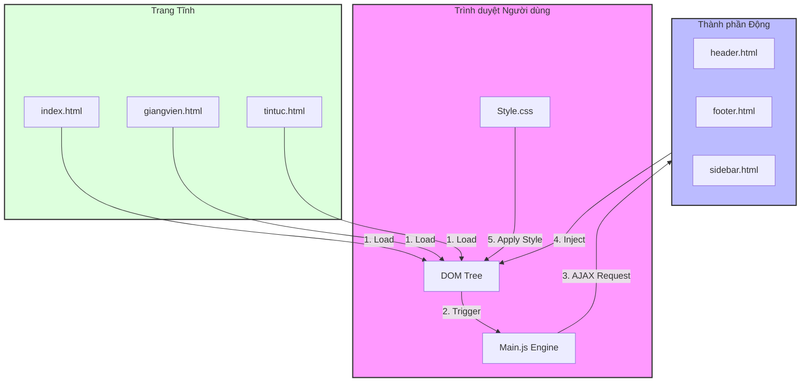

# Sơ đồ Kiến trúc Hệ thống

Dưới đây là sơ đồ mô tả luồng hoạt động của dự án:

```mermaid
graph TD
    subgraph Browser_Client [Trình duyệt Người dùng]
        DOM[DOM Tree]
        JS_Engine[Main.js Engine]
        CSS_Engine[Style.css]
    end

    subgraph Pages [Trang Tĩnh]
        P1[index.html]
        P2[giangvien.html]
        P3[tintuc.html]
    end

    subgraph Components [Thành phần Động]
        C1[header.html]
        C2[footer.html]
        C3[sidebar.html]
    end

    P1 & P2 & P3 -->|1. Load| DOM
    DOM -->|2. Trigger| JS_Engine
    JS_Engine -->|3. AJAX Request| Components
    Components -->|4. Inject| DOM
    CSS_Engine -->|5. Apply Style| DOM
    
    style Browser_Client fill:#f9f,stroke:#333,stroke-width:2px
    style Components fill:#bbf,stroke:#333,stroke-width:2px
    style Pages fill:#dfd,stroke:#333,stroke-width:2px
```
